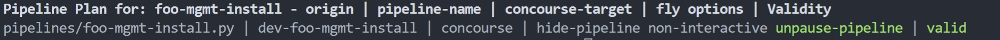
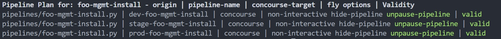
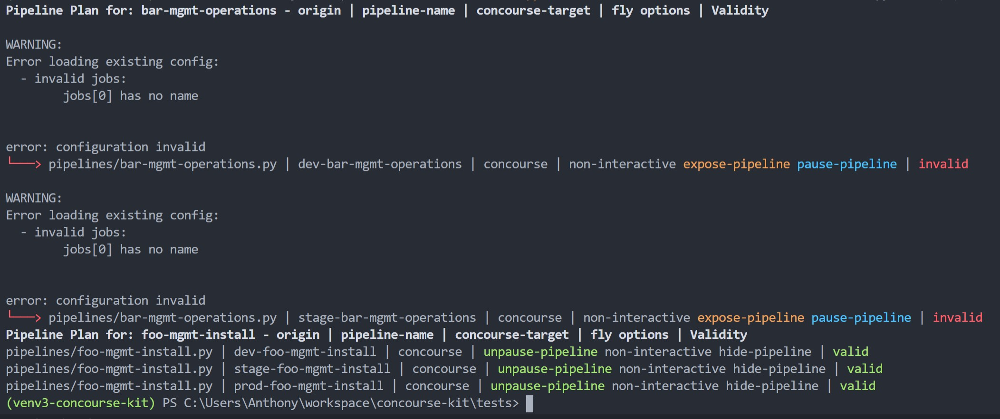
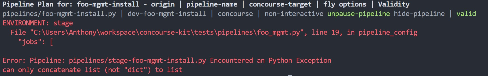

# Concourse Kit - For Extreme Pipelining
Concourse Kit is a highly opinionated approach to developing, generating, testing, validating, and setting, multiple, domain-specific, concourse pipelines within a single mono-repo.

It's primarily aimed at platform or infrastructure teams who maintain, build, and automate against specific platforms such as Cloud Foundry, Kubernetes or manage multiple, large, and complex platforms or workflows.

These automation workloads typically share a lot of common data, tasks, and deploy multiple instances of the same pipeline which target specific environments. 

## Opinions
* **Generated - Not Declared:** Pipelines used to automate entire platforms typically end up in the thousands-of-lines of YAML and can get incredibly repetitive. Templating YAML can become incredibly tricky.  Concourse Kit specifies that pipelines are literally, *as code* and are generated into the required pipeline YAML.
* **Python Focused:** Pipelines are written as Python 3.9 code, and all tasks are encouraged to use Python as well the reasons being are:
  * Python is more readable than Bash scripting.
  * Python is more testable than Bash scripting.
  * Python is powerful enough to generate any required pipeline configuration.
  * Python is more approachable to a wider audience vs languages such as Go.
* **Mono Repo:** Automation which operates on the same domain should be contained within the same repo.  This makes sharing resources, tasks, environment data, and commonly used scripts easily recyclable. 

## Conventions
Concourse Kit Specifies the following Conventions to be followed.

* Code which generates into a pipeline config should be within `pipelines`
* Code which tests a pipeline config should be within `pipeline_tests`
* Environment data specific to concourse environments should be within `concourse-environments`
* Environment data specific to automation targets should be within `target-environments`
* Setting a pipeline is done using the `cc_kit.py` script. 

## Requirements
To getup and running with Concourse Kit, you will need the following.
* **Python 3.9:** You will need Python 3.9+ installed as this cck makes use of the union operator for dictionaries.
* **fly CLI:** You will need the fly CLI installed as concourse kit invokes it to validate, and set pipelines for you.
* **An Open Mind:** Yes, this is a very unconventional approach to developing and managing pipelines but it might just be crazy enough to work.

## Installing
```
pip install concoursekit
```
Concoursekit is installed using pip.  This will install the module and make the `cck` CLI utility available. 

Once installed you can run the following to initialize a new working directory for concoursekit to manage.
```
cck --init
```
This will place a `.cck.yml` file in the directory which provides some basic configuration defaults for cck.
```yaml
# The default concourse target to use
concourse_target: concourse

# These options are allowed.
# fly_default_options:
# - non-interactive | interactive
# - hide-pipeline | expose-pipeline
# - unpause-pipeline | pause-pipeline

# When Setting a Pipeline Fly will use these options
fly_default_options:
- interactive
- hide-pipeline
- unpause-pipeline

# The directory to import <pipeline_name>.py files from. 
pipelines_dir: pipelines

# The directory to look for <pipeline_name>_test.py files from.
pipelines_test_dir: pipeline_tests

# The directory to use for target-environments
target_environments_dir: target_environments
```


## cck CLI
**The `cck` utility is the entry point into concourse kit. It has three primary commands.**

```
cck --gen-pipeline
```
Generates a pipeline.yml file from a pipeline.py file.


```
cck --set-pipeline
```
Invokes fly to set one or more pipelines.


```
cck --test-pipeline
```
Runs PyTest for one or more pipelines. Useful for  testing pipeline configuration results.

**Each of the commands above can take the following arguments.**

```
cck --set-pipeline --name <pipeline_name> --env <env>
```
Set a specific pipeline for a specific environment.

```
cck --set-pipeline --name <pipeline_name> --all
```
Set a specific pipeline for all target environments it's scoped to. 


```
cck --set-pipeline --all
```
Set all pipelines for all target environments each pipeline is scoped to.


```
cck --gen-pipeline --name <pipeline_name> --env <env>

```
Generate a single `pipeline.yml` file for a specific pipeline for a specific environment.

```
cck --test-pipeline --name <pipeline_name>
```
Run a PyTest test for a specific pipeline.

```
cck --test-pipeline --all
```
Run all PyTest tests for all pipelines.

**The Set Command can also take a `--plan` flag.**
```
cck --set-pipeline --name <pipeline_name> --all  --plan
```
```
cck --set-pipeline --name --all  --plan
```
Display pipeline names, their source `.py` file, the environments they will target and validates their configurations.

## Environments
Concourse Kit organizes pipeline automation around the concept of target environments. Target environments contain all the variables and file content specific to one or more target environments.  From the perspective of automation, the automation jobs are always targeting infrastructure, APIs, or resources in a specific environment, hence the name `target-environments`.

In order for the `cck` CLI to function and generate or set a pipeline, you must declare at least one environment directory under the `target-environments` directory.  An example of how to organize targets may look like such:
```
target-environments
├───common
├───dev
│   ├───eu-dev
│   └───us-dev
├───prod
├───sandbox
└───stage
```

The `concourse-environments` directory should contain data and file content related to deploying concourse itself and it's environments. This helps isolate automation data from the target data. 

## Generating Pipeline Configurations
All pipeline YAML configurations are *generated*, not declared or templated.  To configure a new pipeline, a new `pipelines/<pipeline_name>.py` must be created.

### Hello World
This is the documented Hello World example on the concourse site. 
```yaml
---
jobs:
- name: job
  public: true
  plan:
  - task: simple-task
    config:
      platform: linux
      image_resource:
        type: registry-image
        source: { repository: busybox }
      run:
        path: echo
        args: ["Hello world!"]
```
To configure this pipeline using cck, a new `pipelines/hello_world.py` file would need to be created and contain the following.  It **must** have a top-level function defined as `pipeline_config` which returns a `dict`.

```python
def pipeline_config():
  return  {
    "jobs": [
        {
          "name": "hello-world-job",
          "plan": [
            {
              "task": "hello-world-task",
              "config": {
                "platform": "linux",
                "image_resource": {
                  "type": "registry-image",
                  "source": {
                    "repository": "busybox"
                  }
                },
                "run": {
                  "path": "echo",
                  "args": ["hello world!"]
                }
              }
            }
          ]
        }
    ]  # end jobs
}
```
To Generate the pipeline the following is run.  Even though the environment isn't used in this example, the generate command still requires it.
```bash
> cck --generate-pipeline --name hello_world --env dev
Generating Pipeline to hello_world.yml
```
This will generate the same yaml as shown above.
### Using Environments
Typically, if you are automating infrastructure or complex platforms, you will have one pipeline which targets one or more environments. For example, if you deploy and manage a Kubernetes cluster, you would want to install it exactly the same for dev, stage, and prod with the only difference being environmental specific values for variables, endpoints, certs etc. 

If we think about our `pipeline.py` as a function, and the `target-environment` data as the input parameters, we can generate an environment specific pipeline per each environment. 

Given the following target environments.
```
target-environments
  ├───dev
  │   └───vars.yml
  ├───prod
  |   └───vars.yml
  └───stage
      └───vars.yml
```
and within each vars.yml file a environment specific endpoint.
```yaml
# target-environments/dev/vars.yml
api-endpoint: dev.api.some.target.foocorp.int
```
```yaml
# target-environments/stage/vars.yml
api-endpoint: stage.api.some.target.foocorp.int
```
```yaml
# target-environments/prod/vars.yml
api-endpoint: prod.api.some.target.foocorp.int
```

Within the `pipelines/example.py` file our config looks like the below.  Note that Concourse Kit makes use of YAMLmaker to aid with YAML generation. You can read more on how to use YAMLmaker [here](https://github.com/Anthonyhawkins/yamlmaker).

The value for the `target-environment` is always under the os environment variable: `ENVIRONMENT`.  When using the `ENVIRONMENT` variable, we can source in the variables specific for the environment we are generating a configuration for. 

```python
from yamlmaker import Sources
from yamlmaker import env

def pipeline_config():

  sources = Sources({
    "vars": "target-environments/" + env("ENVIRONMENT") + "/vars.yml"
  })

  return {
    "jobs": [
        {
          "name": "hello-world-job",
          "plan": [
            {
              "task": "hello-world-task",
              "config": {
                "platform": "linux",
                "image_resource": {
                  "type": "registry-image",
                  "source": {
                    "repository": "busybox"
                  }
                },
                "params": {
                  "API_ENDPOINT": sources.grab("vars", "api-endpoint")
                },
                "run": {
                  "path": "echo",
                  "args": ["hello world!"]
                }
              }
            }
          ]
        }
    ]  # end jobs
}
```
Generate the pipeline.yml
```bash
> cck --generate-pipeline --name hello_world --env dev
Generating Pipeline to hello_world.yml
```
Our generated config now looks like this, as you can see the dev specific variable is used.
```yaml
jobs:
- name: hello-world-job
  plan:
  - task: hello-world-task
    config:
      platform: linux
      image_resource:
        type: registry-image
        source:
          repository: busybox
      params:
        API_ENDPOINT: dev.api.some.target.foocorp.int
      run:
        path: echo
        args:
        - hello world!

```

The `--generate` command can only generate a config for one environment at a time.  You cannot specify the `--all` flag when generating a pipeline config.

## Setting a Single Pipeline
You can set a pipeline two ways, the first being the normal `fly` method and passing in a generated yaml file as the pipeline config.  The second method is to have `cck` invoke `fly` for you to set a pipeline for one or more environments.

### Setup a fly Target
To have `cck` set a pipeline first set a `fly` target of `concourse` like so:
```bash
fly -t concourse login -c http://localhost:8080 -u example -p example
```
You can target a different team if you'd like, for this example it will just use the `main` team.

### Setting the Pipeline
When a pipeline is set, it will be generated and immediately set.  The name of the pipeline is the same as the `pipeline.py` file with underscores replaced with dashes.  In addition, the `target-environment` is prefixed to the name.
```
> cck --set-pipeline --name hello_world --env dev
Generating Pipeline to dev-hello-world.yml
Setting pipeline: dev-hello-world
jobs:
  job hello-world-job has been added:
+ name: hello-world-job
+ plan:
+ - config:
+     image_resource:
+       source:
+         repository: busybox
+       type: registry-image
+     params:
+       API_ENDPOINT: dev.api.some.target.foocorp.int
+     platform: linux
+     run:
+       args:
+       - hello world!
+       path: echo
+   task: hello-world-task

apply configuration? [yN]: 
```
### Setting a Pipeline for Multiple Environments.
Specifying the `--all` flag when using the `--set-pipeline` command will attempt to set the pipeline for all environments, except for defined within the `.cck.yml` under `ignore_environments: []`.  By default, the `common` environment has been added for you. 

For this to work, every `target-environment` must have all the same var yaml files, content files etc. otherwise the pipeline will work for some environments, not others.  

```
> cck --set-pipeline --name hello_world --all
Generating Pipeline to dev-hello-world.yml
Setting pipeline: dev-hello-world
jobs:
  job hello-world-job has been added:
+ name: hello-world-job
+ plan:
+ - config:
...
+       - hello world!
+       path: echo
+   task: hello-world-task

apply configuration? [yN]: y
pipeline created!
you can view your pipeline here: http://localhost:8080/teams/main/pipelines/dev-hello-world

the pipeline is currently paused. to unpause, either:
  - run the unpause-pipeline command:
    fly -t concourse unpause-pipeline -p dev-hello-world
  - click play next to the pipeline in the web ui
Generating Pipeline to prod-hello-world.yml
Setting pipeline: prod-hello-world
jobs:
  job hello-world-job has been added:
+ name: hello-world-job
+ plan:
...
+       - hello world!
+       path: echo
+   task: hello-world-task

apply configuration? [yN]: y
pipeline created!
you can view your pipeline here: http://localhost:8080/teams/main/pipelines/prod-hello-world

the pipeline is currently paused. to unpause, either:
  - run the unpause-pipeline command:
    fly -t concourse unpause-pipeline -p prod-hello-world
  - click play next to the pipeline in the web ui
Generating Pipeline to stage-hello-world.yml
Setting pipeline: stage-hello-world
jobs:
  job hello-world-job has been added:
+ name: hello-world-job
+ plan:
...
+       - hello world!
+       path: echo
+   task: hello-world-task

apply configuration? [yN]: y
pipeline created!
```

### Setting for All Environments, Except One or More Environments
Sometimes you may wish to set all environments, except one or more of them.  To accomplish this, you can negate specific environments by appending the target-environment name with a bang `!`.  
```
> cck --set-pipeline --name hello_world --all  --env !sandbox
```
This will set for all environments, except the sandbox environment.


### Scoping a Pipeline to Specific Environments.
It's rare that you will have a pipeline which needs to target *every* environment, however, it is fairly common that pipelines will need to target multiple *specific* environments.

To declare which `target-environments` a pipeline should target, you can declare the top-level variable, `pipeline_environments`, within the `pipelines/pipeline.py` file like so.
```python
from yamlmaker import Sources
from yamlmaker import env

pipeline_environments = [
  "dev",
  "stage"
]

def pipeline_config():
  sources = Sources({
    "vars": "target-environments/" + env("ENVIRONMENT") + "/vars.yml"
  })

  return {
      "jobs": [
          {
            "name": "hello-world-job",
            "plan": [
              {
                "task": "hello-world-task",
                "config": {
                  "platform": "linux",
                  "image_resource": {
                    "type": "registry-image",
                    "source": {
                      "repository": "busybox"
                    }
                  },
                  "params": {
                    "API_ENDPOINT": sources.grab("vars", "api-endpoint")
                  },
                  "run": {
                    "path": "echo",
                    "args": ["hello world!"]
                  }
                }
              }
            ]
          }
      ]  # end jobs
  }

```
When you run `cck` with the `--all` flag again, it will only set the pipeline for the environments declared within the `pipeline_environments` list.
```
> cck --set-pipeline --name hello_world --all
Generating Pipeline to dev-hello-world.yml
Setting pipeline: dev-hello-world
no changes to apply
Generating Pipeline to stage-hello-world.yml
Setting pipeline: stage-hello-world
no changes to apply
``` 

### Pipeline Suffix
Sometimes it's handy to label or append a suffix to the end of a pipeline name to give it some context when working with many pipelines.  For example, you may have a few pipelines which deal with operating a platform or a few pipelines which deal with just install or update specific tasks.  

You can provide a suffix to be applied to the pipeline name by declaring the following top level variable: `pipeline_suffix`. 

```python
pipeline_suffix = "operations"

def pipeline_config():
  return {
      "jobs": [
          {
            "name": "hello-world-job",
            "plan": [
              {
                "task": "hello-world-task",
                "config": {
                  "platform": "linux",
                  "image_resource": {
                    "type": "registry-image",
                    "source": {
                      "repository": "busybox"
                    }
                  },
                  "run": {
                    "path": "echo",
                    "args": ["hello world!"]
                  }
                }
              }
            ]
          }
      ]  # end jobs
  }
```

```
> cck --set-pipeline --name hello_world --env dev
```

```
Generating Pipeline to dev-hello-world-operations.yml
Setting pipeline: dev-hello-world-operations
jobs:
...
+   task: hello-world-task

apply configuration? [yN]: y
pipeline created!
you can view your pipeline here: http://localhost:8080/teams/main/pipelines/dev-hello-world-operations

the pipeline is currently paused. to unpause, either:
  - run the unpause-pipeline command:
    fly -t concourse unpause-pipeline -p dev-hello-world-operations
  - click play next to the pipeline in the web ui
  ```

### Fly Options
When setting pipelines using `fly` it's often common to run it with the `non-interactive` option, or to immediately hide, expose, pause, or unpause a pipeline.  To make this easier and explicate, you can specify a top-level variable named `fly_options = []`

For example a pipeline would be configured as such, and when it's set it won't confirm with you, it will unpause it, and automatically hide it. 
```python
fly_options = [
  "non-interactive",
  "unpause-pipeline",
  "hide-pipeline"
]

def pipeline_config():
  ...
```
```
> cck --set-pipeline --name foo_mgmt --end dev
Setting pipeline: dev-foo-mgmt
Generating Pipeline to dev-foo-mgmt.yml
no changes to apply
hid 'dev-foo-mgmt'
unpaused 'dev-foo-mgmt'
```

### Specifying a Concourse Target
By default, `cck` will use the target specified within the `.cck.yml` file when running the `fly` command.  If you want to set your pipeline to a different target, you can use the top-level variable `concourse_target = str`.
```python
concourse_target = "my-cool-team"

def pipeline_config():
  ...
```
## Setting All Pipelines
In the event you need to re-set ALL your pipelines for ALL environments (perhaps you have to re-deploy concourse, or restore them.)  It's possible to do this with one command.

Take the following pipelines and environments.
```
├───concourse-environments
├───pipelines
│   ├───bar_mgmt.py
│   └───foo_mgmt.py
├───pipeline_tests
├───resources
├───target-environments
│   ├───common
│   ├───dev
│   ├───prod
│   └───stage
└───tasks
```
and `bar_mgmt` is scoped to `dev` and `stage`, `foo_mgmt` is scoped to `dev`, `stage`, and `prod`. 

Running the following command will set all pipelines for the environments they are scoped to.  `cck` will give you a 10 second window to abort the command if you ran it by mistake.
```
> cck --set-pipeline --all
```
```
Setting all pipelines in 10 seconds... ctl+c to cancel.
Generating Pipeline to dev-bar-mgmt-operations.yml
Setting pipeline: dev-bar-mgmt-operations
...
Generating Pipeline to stage-bar-mgmt-operations.yml
Setting pipeline: stage-bar-mgmt-operations
...
Generating Pipeline to dev-foo-mgmt-install.yml
Setting pipeline: dev-foo-mgmt-install
...
Generating Pipeline to stage-foo-mgmt-install.yml
Setting pipeline: stage-foo-mgmt-install
...
Generating Pipeline to prod-foo-mgmt-install.yml
Setting pipeline: prod-foo-mgmt-install
...
```
```
> fly -t concourse pipelines
name                        paused  public  last updated
dev-foo-mgmt-install        yes     no      2021-07-04 20:41:13 -0500 CDT
stage-foo-mgmt-install      yes     no      2021-07-04 20:41:14 -0500 CDT
prod-foo-mgmt-install       yes     no      2021-07-04 20:41:16 -0500 CDT
dev-bar-mgmt-operations     yes     no      2021-07-04 20:41:10 -0500 CDT
stage-bar-mgmt-operations   yes     no      2021-07-04 20:41:12 -0500 CDT
```

## Planning Pipelines
Before setting pipelines, it's a wise idea to preview how `cck` will name, set, and toggle all the various `fly` options before actually setting.  In addition, you may want to ensure your configuration is valid from a Concourse perspective, even though it's valid from a Python perspective. 

### Planning a Single Pipeline and Target Environment
Running the following command will display a plan for a single pipeline and environment.
```
> cck --set-pipeline --name foo_mgmt --env dev --plan
```

### Planning a Single Pipeline and All Target Environments
```
> cck --set-pipeline --name foo_mgmt --all --plan
```

### Planning All Pipelines and All Target Environments
Below is an example of an invalid configuration and also shows the various colors!
```
> cck --set-pipeline --all --plan
```


### Python Exceptions During Plan
Sometimes if you are developing a configuration and validating it, you may run into a Python Exception which `cck` is unable to handle.  In this instance, `cck` will provide you with just the traceback for the `pipeline.py` config you are working on, like so, and provide you with the `ENVIRONMENT` it was trying to generate for. 




## Testing Pipelines
Because all of the pipelines `cck` manages are *generated*, it might be a good idea to have a companion test which can ensure the pipeline will be generated correctly.  

Let's say you have a really complicated pipeline which has environment-specific jobs or other conditionals.  You can write a companion test to ensure that when the pipeline config is generated it has right number of jobs etc.  You can write a test as complex or as simple as you want, it's up to you.

### Testing a Single Pipeline
Let's write a test for `pipelines/foo_mgmt.py`.  To do this we create and write a test under `pipelines_tests/foo_mgmt_test.py`.
```python
#pipelines/foo_mgmt.py
from yamlmaker import env
from yamlmaker import Include

pipeline_suffix = "install"

pipeline_environments = [
  "dev",
  "stage",
  "prod"
]

def pipeline_config():
  return {
      "jobs": [
          {
            "name": "foo-job-" + env("ENVIRONMENT"),
            "plan": [
              {
                "task": "foo-task",
                "config": {
                  "platform": "linux",
                  "image_resource": {
                    "type": "registry-image",
                    "source": {
                      "repository": "busybox"
                    }
                  },
                  "run": {
                    "path": "echo",
                    "args": ["for all envs"]
                  }
                }
              }
            ]
          }
      ] + Include.when(env("ENVIRONMENT") == "dev", [
        {
          "name": "bar-job-" + env("ENVIRONMENT"),
          "plan": [
            {
              "task": "bar-task",
              "config": {
                "platform": "linux",
                "image_resource": {
                  "type": "registry-image",
                  "source": {
                    "repository": "busybox"
                  }
                },
                "run": {
                  "path": "echo",
                  "args": ["only in dev!"]
                }
              }
            }
          ]
        }
    ]) # end jobs
  }

```
The following test will verify that when given a specific environment, the correct number of jobs are defined. This is a simple example, but what you want to test for or verify is up to you depending on the complexity of the pipeline being generated.
```python
#pipeline_tests/foo_mgmt_test.py
import os
from pipelines.foo_mgmt import pipeline_config

def test_dev_has_two_jobs():
  os.environ["ENVIRONMENT"] = "dev"
  config = pipeline_config()
  assert len(config["jobs"]) == 2
  
def test_prod_has_one_job():
  os.environ["ENVIRONMENT"] = "prod"
  config = pipeline_config()
  assert len(config["jobs"]) == 1
```
Running the test.
```
> cck --test-pipeline --name foo_mgmt
```
```
Testing Pipeline: foo_mgmt
================================================================================================= test session starts =================================================================================================
platform win32 -- Python 3.9.1, pytest-6.2.4, py-1.10.0, pluggy-0.13.1
rootdir: C:\Users\Anthony\workspace\concourse-kit
collected 2 items

pipeline_tests\foo_mgmt_test.py ..

======================================================================================================= PASSES ========================================================================================================
=============================================================================================== short test summary info ===============================================================================================
PASSED pipeline_tests/foo_mgmt_test.py::test_dev_has_two_jobs
PASSED pipeline_tests/foo_mgmt_test.py::test_prod_has_one_job
================================================================================================== 2 passed in 0.02s ==================================================================================================
```
### Testing all Pipelines
If you want to verify all pipelines are passing their tests, simply run the following
```
> cck --test-pipeline --all
```
```
Testing All Pipelines
================================================================================================= test session starts =================================================================================================
platform win32 -- Python 3.9.1, pytest-6.2.4, py-1.10.0, pluggy-0.13.1
rootdir: C:\Users\Anthony\workspace\concourse-kit
collected 3 items

pipeline_tests\bar_mgmt_test.py .
pipeline_tests\foo_mgmt_test.py ..

======================================================================================================= PASSES ========================================================================================================
=============================================================================================== short test summary info ===============================================================================================
PASSED pipeline_tests/bar_mgmt_test.py::test_dev_has_two_jobs
PASSED pipeline_tests/foo_mgmt_test.py::test_dev_has_two_jobs
PASSED pipeline_tests/foo_mgmt_test.py::test_prod_has_one_job
================================================================================================== 3 passed in 0.03s ==================================================================================================